# HISA People Chain Protocol Structure

```mermaid
graph TD
  A[HISA PEOPLE Main Protocol] 
  A --> B[🌿 JANI HISA]
  A --> C[🏛️ UMOJA HISA]
  A --> D[🎤 CULTURE HISA]
  B --> E[JANI Token]
  B --> F[JANI Stable]
  C --> G[UMOJA Token]
  C --> H[UMOJA Stable]
  C --> I[UMOJA Option]
  D --> J[CULTURE Asset Token]
  A --> K[$HISA Token]
  K --> L[AI Fuel]
  K --> M[Governance]
  K --> N[Rewards]
```

## Protocol Components

### Main Protocol
- **HISA PEOPLE Main Protocol** - Main  framework

### Branch Protocols
- **🌿 JANI HISA** - Environmental conservation branch
- **🏛️ UMOJA HISA** - Community asset management branch  
- **🎤 CULTURE HISA** - Cultural preservation branch

### Token Structure
- **$HISA Token** - Core utility token (AI Fuel, Governance, Rewards)
- **JANI Token** - Environmental  conservation database with rewards
- **JANI Stable** - Green economy stablecoin
- **UMOJA Token** - Asset tokenization
- **UMOJA Stable** - Asset trading liquidity
- **UMOJA Option** - Asset speculation mechanism
- **CULTURE Asset Token** - preserve Culture via NFTs with royalties